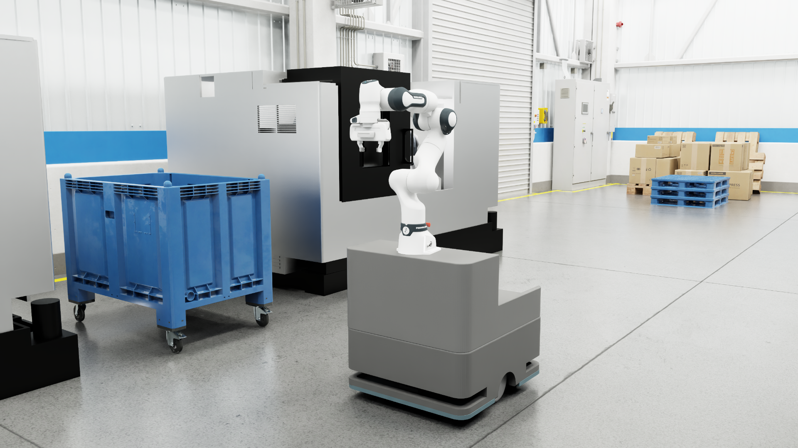

# 🍈 Melon Robot @Factory with ROS2 Humble


This repository provides a plugin for running the mobile manipulator **Melon** in the **@factory** environment. It also includes a USD file download script and Melon demo code running as a ROS2 Humble application.<br>

## 🎯 Overview

**Melon** is a mobile arm robot designed to be used in conjunction with NVIDIA Isaac Sim in the @factory environment.

This project provides the following features when running in the @factory environment:

- **Providing a plugin for at_factory (mainly consisting of USD definitions)**
- **Basic functionality for operating as a ROS2 robot, and a sample application**
    - arm motion planning using MoveIt2
    - autonomouse navigation using Nav2
    - sample application using Behavior Tree

## 🚀 Installing

### 1. Plugging into the @factory environment


For details on how to plug into @factory, please refer to the [at_factory repository](https://github.com/momoiorg-repository/at_factory.git)<br>
For reference, the actual USD is in the [finstall.sh script](https://github.com/momoiorg-repository/at_factory?tab=readme-ov-file#finstallsh-%E3%82%B9%E3%82%AF%E3%83%AA%E3%83%97%E3%83%88) in this repository, and it will be downloaded automatically.

### 2. Running Docker to run Melon as a ROS2 robot  
Follow these steps:

## ROS2 related settings  
### 1.Clone the repository
```bash
git clone https://github.com/momoiorg-repository/melon_ros2.git
cd melon_ros2
```

### 2. ROS2 environment setup
Edit the `.env` file to set the environment variables:

```bash
# Example of .env file settings
ROS_DOMAIN_ID=31                    # ROS Domain ID
CONTAINER_NAME=melon_ros2_app  # container name
```

### 3. Building and running a Docker container

By running the following script, you can create a Docker image, create a Docker container, and then connect to it all at once.

```bash
./build.sh
```
Once connected to the container, follow the prompts to perform the initial setup.<br>

- Run the above script only the first time.
- From the second time onwards, you can connect directly using the following (,or this will run automatically if you are using VSCode):

```bash
docker start <your container name>
docker exec -it <your container name> bash
```

## 🤖 How to use

### It is assumed that the plugin work to @factory has been completed.

### Simultaneous launch of MoveIt2 and Nav2
Launch file that allows arm control and base movement at the same time:
```bash
ros2 launch melon_bringup melon_bringup.launch.py
```

### Launching MoveIt2 only case
Launch MoveIt2 for arm control:

```bash
ros2 launch melon_moveit_config melon_moveit.launch.py
```

### Launching Nav2 only case

Launch Nav2 for base movement:

```bash
ros2 launch melon_navigation2 navigation.launch.py
```
1. `2D Pose Estimate` (specifying the initial pose)
2. `Nav2 Goal` (Start Navigation)

### Running an application using Behavior Tree and ros_actor
Please refer to [here](./doc/App_README.md) for instructions on how to use the application.

## 🐛 Troubleshooting

### Common problems and solutions

#### ROS2 communication issues
```bash
# Check DDS settings
export RMW_IMPLEMENTATION=rmw_fastrtps_cpp
export FASTRTPS_DEFAULT_PROFILES_FILE=/root/fastdds.xml

# Check ROS_DOMAIN_ID setting
# Set this to the same ROS_DOMAIN_ID as your at_factory repository.
echo $ROS_DOMAIN_ID
export ROS_DOMAIN_ID=<Any value>
```

#### GUI apps are not displayed
- Check that the DISPLAY environment variable is correct.
- Change to the correct value it if it's incorrect.
```bash
echo $DISPLAY

# Example
export DISPLAY=<your IP>:0
```

#### When you can't communicate with Isaac Sim
- Start the Isaac Sim simulation first and then run Moveit2 or Nav2.
- Check that the ROS Bridge on the Isaac Sim side is running.
- Check that the ROS_DOMAIN_ID matches.

## 🧩 Dependency
The Melon arm is based on Franka Emika Panda without any modifications.

## 📄 license  
See the [LICENSE](./LICENSE) file for license information for this project.

## 📚 reference  
- [at_factory](https://github.com/momoiorg-repository/isaacsim-common)
- [franka_description](https://github.com/frankarobotics/franka_description)
- [LimeSimulDemo](https://github.com/momoiorg-repository/LimeSimulDemo/tree/main)
